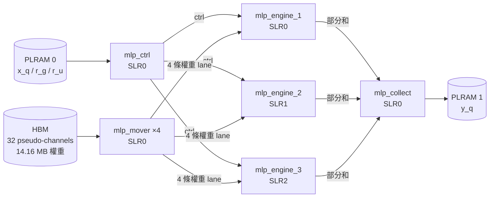

# Gemma-4-E2B MLP Accelerator on Alveo U280

以 Vitis HLS 實作的 LLM 解碼（decode）階段 MLP 硬體加速器，目標平台為 Xilinx Alveo U280（3 個 SLR、32 個 HBM pseudo-channel）。
目前實作的是 Gemma-4-E2B **第 15 層** MLP：INT2 權重（QAT 量化訓練取得）、INT8 activation，整條資料路徑全部為整數運算，輸出為 INT16。

| 項目 | 內容 |
|---|---|
| 工具 | Vitis / Vitis HLS / Vivado **2023.2**、XRT 2.16 |
| 平台 | `xilinx_u280_gen3x16_xdma_1_202211_1` |
| Kernel 時脈 | 200 MHz |
| 模型 | Gemma-4-E2B，`hidden_size` = 1536，`intermediate_size` = 12288 |
| 精度 | 權重 INT2、activation INT8、輸出 INT16 |

---

## 目錄

1. [架構](#1-架構)
2. [目前成果](#2-目前成果)
3. [檔案說明](#3-檔案說明)
4. [在 Vitis IDE 建立專案](#4-在-vitis-ide-建立專案)
5. [Software Emulation](#5-software-emulationemulation-sw)
6. [Hardware Emulation](#6-hardware-emulationemulation-hw)
7. [Hardware（上板執行）](#7-hardware上板執行)
8. [結果分析：報告與路徑](#8-結果分析報告與路徑)
9. [命令列建置（不用 IDE）](#9-命令列建置不用-ide)
10. [本機快速驗證（不需 FPGA）](#10-本機快速驗證不需-fpga)
11. [常見問題](#11-常見問題)

---

## 1. 架構

一個 token 經過 MLP 的運算：

```
x（1536）
 ├─ gate_proj（12288 × 1536）→ g
 └─ up_proj  （12288 × 1536）→ u
              h = GELU(g) × u        （12288）
    down_proj（1536 × 12288）→ y     （1536，INT16）
```

硬體由 **4 種 kernel、共 9 個 compute unit（CU）** 組成：



| Kernel | CU 數 | 位置 | 功能 |
|---|---|---|---|
| `mlp_mover` | 4 | SLR0 | 每個 CU 讀 8 個 HBM pseudo-channel，經 AXI-Stream 把權重送給 3 個 engine（每個 engine 收 4 條 lane） |
| `mlp_ctrl` | 1 | SLR0 | 從 PLRAM 讀 `x_q`（INT8 輸入向量）、`r_g` / `r_u`（gate / up 的 INT32 requant 乘數），廣播給 3 個 engine |
| `mlp_engine` | 3 | SLR0 / 1 / 2 | 每個有 1,536 個 DSP 的 MAC 陣列，依序計算 gate/up、GELU、down。**free-running**（`ap_ctrl_none`），host 不會啟動它 |
| `mlp_collect` | 1 | SLR0 | 把 3 個 engine 的 INT32 部分和相加，乘上 `c_down`（down_proj 的 requant 乘數），量化成 INT16 寫入 `y_q` |

每個 DSP48E2 一次做 2 個 INT2 × INT8 乘加（權重打包，見 `mlp_dsp_mac.v`）。累加器留在 DSP 內部，所以這部分用 RTL blackbox 撰寫，而不是 HLS C++。

---

## 2. 目前成果

| 項目 | 結果 |
|---|---|
| 功能 | 上板 11 組測試輸入，輸出與軟體 golden model **逐位元一致** |
| 時序 | 200 MHz 通過（WNS +0.016 ns） |
| 資源（每個 engine） | DSP 1,545（單一 SLR 的 51%）、LUT 160k（36%）、URAM 128（40%） |
| HLS 預估 | 每個 token 約 33.3k cycle（200 MHz 下約 167 µs） |
| 上板實測（FPGA 端） | 每個 token 約 0.49 ms（約 98k cycle） |
| 上板實測（含 host 傳輸） | 每個 token 約 0.70 ms |

實測約為 HLS 預估的 3 倍，原因還在調查（HBM 實際讀取效率或 engine 內部停頓），需要 hardware emulation 的 stall 數據來判斷。

**理論上限（一層 MLP、一個 token）**：

| 上限 | 計算 | 時間 |
|---|---|---|
| DSP 運算峰值 | 56.6M MAC ÷（3 × 1,536 DSP × 2 MAC/cycle） | 30.7 µs |
| HBM 頻寬峰值 | 14.16 MB ÷ 460.8 GB/s | 30.7 µs |
| kernel 埠（32 × 256 bit @200 MHz） | 14.16 MB ÷ 204.8 GB/s | 69 µs |
| mover 設計（II = 4） | 14.16 MB ÷ 153.6 GB/s | 92 µs |

---

## 3. 檔案說明

### Kernel（放進 kernel 專案）

| 檔案 | 說明 |
|---|---|
| `mlp_mover.cpp` | Kernel：HBM → 權重 lane |
| `mlp_ctrl.cpp` | Kernel：輸入與 requant 參數廣播 |
| `mlp_engine.cpp` | Kernel：MAC 陣列、GELU、down_proj |
| `mlp_collect.cpp` | Kernel：跨 SLR 加總、輸出量化 |
| `mlp_common.h` | Kernel 共用的函式與常數 |
| `kernel.h` | 所有尺寸參數與 kernel 宣告（host 也會 include） |
| `gelu_luts.h` | GELU 查表，由 `gen_luts.py` 產生（host 也會 include） |

### RTL blackbox（不放進 IDE 專案，放在 workspace 根目錄）

| 檔案 | 說明 |
|---|---|
| `mlp_dsp_mac.v` | 一個 DSP48E2 的打包乘加 RTL |
| `mlp_dsp_mac.cpp` | 上面 RTL 對應的 C 模型 |
| `mlp_blackbox.tcl` | 在 HLS 合成前登錄 blackbox，執行時會在同一目錄產生 `mlp_dsp_mac.json` |
| `mlp_engine_compile.cfg` | `mlp_engine` 的 v++ compile 設定，指向 `mlp_blackbox.tcl` |

### Host（放進 host 專案）

| 檔案 | 說明 |
|---|---|
| `host.cpp` | OpenCL host 程式：載入權重、執行、比對結果、印出 profiling |
| `help_functions.cpp` / `.h` | 讀檔與 profiling 輔助函式 |
| `mlp_model.h` | golden model、層資料的讀取函式、測試案例 |
| `kernel.h`、`gelu_luts.h` | 與 kernel 共用 |

### Link 與實作設定（放在 workspace 根目錄）

| 檔案 | 說明 |
|---|---|
| `mlp_link.cfg` | v++ link 設定：HBM 綁定（`sp=`）、kernel 間串流（`stream_connect=`）、SLR 指定、Vivado 策略 |
| `mover_pblocks.tcl` | placement 前執行，限制各 CU 的擺放區域（pblock） |
| `mlp_replicate.tcl` | 由 `mover_pblocks.tcl` 呼叫，複製 74 條 high-fanout net |

### 工具與測試

| 檔案 | 說明 |
|---|---|
| `build_hw.sh` | 命令列依序建置 4 個 IDE 專案（可在 tmux 中執行） |
| `run_hls.tcl` | 單獨用 Vitis HLS 做 csim / csynth / cosim |
| `tb_MLP.cpp` | C simulation testbench（逐位元比對） |
| `tb_model.cpp` | 只跑 golden model 的快速檢查 |
| `gen_luts.py` | 依層的 activation scale 產生 `gelu_luts.h` |
| `bin_packing_mlp.py` | 從量化後的 checkpoint 匯出每層的權重與 scale（`mlp_bin_output/`） |

### 資料

| 路徑 | 說明 |
|---|---|
| `mlp_bin_output/layer_15/` | 第 15 層的權重（32 個 HBM channel 映像）與 scale，約 14 MB。格式說明在 `mlp_model.h` 開頭 |

---

## 4. 在 Vitis IDE 建立專案

### 4.1 匯入原始碼

**Host 專案**：在 Explorer 中，右鍵 `MLP` → `src` → **Import Sources**，從 `$WS` 勾選：

```
host.cpp  help_functions.cpp  help_functions.h  kernel.h  mlp_model.h  gelu_luts.h
```

**Kernel 專案**：右鍵 `MLP_kernels` → `src` → **Import Sources**，勾選：

```
mlp_ctrl.cpp  mlp_mover.cpp  mlp_engine.cpp  mlp_collect.cpp  mlp_common.h  kernel.h  gelu_luts.h
```

`mlp_dsp_mac.v`、`mlp_dsp_mac.cpp`、`mlp_blackbox.tcl` **不要**匯入，它們留在 `$WS` 根目錄，由 `mlp_engine_compile.cfg` 用絕對路徑引用。

### 4.2 加入 Hardware Functions

1. 打開 `MLP_kernels` 底下的 `MLP_kernels.prj`。
2. 在 **Hardware Functions** 區塊點 **Add Hardware Function**（閃電圖示）。
3. 選 `mlp_ctrl`、`mlp_mover`、`mlp_engine`、`mlp_collect` 四個 → OK。

### 4.3 設定 mlp_engine 的編譯選項（Emulation-HW 與 Hardware 都要設）

`mlp_engine` 用到 RTL blackbox，HLS 合成前必須先執行 `mlp_blackbox.tcl`。

1. 左下 **Assistant** 視窗展開 `MLP_kernels` → `Hardware` → `mlp_engine`。
2. 右鍵 → **Settings**。
3. 在 **V++ compiler options** 填入：
   ```
   --config $WS/mlp_engine_compile.cfg
   ```
   （`$WS` 請寫成實際的絕對路徑。）
4. 對 `MLP_kernels` → `Emulation-HW` → `mlp_engine` 重複一次。

其他 3 個 kernel 不需要設定。Emulation-SW 不做 HLS 合成，也不需要。

### 4.4 設定 hw_link（三種組態都要設）

1. 打開 `MLP_system_hw_link` 底下的 `MLP_system_hw_link.prj`。
2. 在 `binary_container_1` 的 kernel 列表中，把 **Compute Units** 欄位設成：

   | Kernel | Compute Units |
   |---|---|
   | `mlp_ctrl` | 1 |
   | `mlp_mover` | **4** |
   | `mlp_engine` | **3** |
   | `mlp_collect` | 1 |

   IDE 會把 CU 命名為 `mlp_mover_1..4`、`mlp_engine_1..3`，`mlp_link.cfg` 裡的設定都是依這些名稱撰寫的。
3. Assistant 展開 `MLP_system_hw_link` → `Hardware` → `binary_container_1` → 右鍵 **Settings** → **V++ linker options** 填入：
   ```
   --config $WS/mlp_link.cfg
   ```
4. 對 `Emulation-HW`、`Emulation-SW` 的 `binary_container_1` 也做同樣設定。emulation 不跑 placement 和 routing，cfg 中 `[vivado]` 段落不會生效，但 `sp=` 和 `stream_connect=` 是必要的。

### 4.5 建置順序（每種組態都一樣）

**必須依照 kernel → hw_link → host → system 的順序建置。**

在 Assistant 視窗中：

1. 選 `MLP_kernels` 底下的目標組態（例如 `Emulation-SW`），按上方的 **Build**（鐵鎚圖示）。
2. 完成後，依序建置 `MLP_system_hw_link`、`MLP` 的同一個組態。
3. 最後選 `MLP_system [System]` 的同一個組態建置。

建置成功的項目會出現綠色勾勾。

---

## 5. Software Emulation（Emulation-SW）

**用途**：以一般 C++ 程式執行 kernel，檢查功能是否正確。速度最快，但沒有任何時序資訊。

### 5.1 建置

依 4.5 的順序建置 `Emulation-SW`，約數分鐘。

### 5.2 設定 Run Configuration（只需做一次）

1. 工具列 **Run**（綠色三角形）旁的下拉選單 → **Run Configurations…**
2. 左側選 **System Project Debug** → 點左上 **New launch configuration**。會產生 `SystemDebugger_MLP_system_MLP`。
3. **Program Arguments** → Edit，填入（以空白分隔）：
   ```
   Xilinx xilinx_u280_gen3x16_xdma_1_202211_1 ./binary_container_1.xclbin 1
   ```

   | 參數 | 意思 |
   |---|---|
   | `Xilinx` | Platform vendor |
   | `xilinx_u280_gen3x16_xdma_1_202211_1` | Device 名稱（emulation 時等於平台名稱） |
   | `./binary_container_1.xclbin` | xclbin 檔 |
   | `1` | 測試案例數（1 ~ 11，預設 11）。emulation 很慢，建議設 1 |
   | （可選）第 5 個參數 | 層資料目錄。不給的話，host 會從執行目錄往上最多 6 層尋找 `mlp_bin_output/layer_15` |

4. **Xilinx Runtime Profiling** → Edit，勾選 **Host trace** 和 **OpenCL trace**。
5. OK → **Run**。

### 5.3 確認結果

Console 最後出現：

```
Host-Info: Test Successful (1/1 cases)
HOST-Info: DONE
```

---

## 6. Hardware Emulation（Emulation-HW）

**用途**：用 HLS 產生的 RTL 逐 cycle 模擬。可以看到**每個 kernel 的精確 cycle 數**和**波形**，是分析效能瓶頸的主要工具。

### 6.1 建置

1. 確認 4.3 已對 `Emulation-HW` 的 `mlp_engine` 設定 `mlp_engine_compile.cfg`。
2. 依 4.5 的順序建置 `Emulation-HW`，約數十分鐘。
3. 確認 `mlp_engine` 的編譯 log（`$WS/MLP_kernels/Emulation-HW/build/mlp_engine/mlp_engine/vitis_hls.log`）有以下兩行：
   ```
   mlp_blackbox.tcl: registered the mlp_dsp_mac RTL blackbox
   ... Final II = 1 ... loop 'job_ktile_job_kstep'
   ```
   第二行的 II 若不是 1，**計算結果會錯誤**，不要使用這個 `.xo`。

### 6.2 執行

1. `MLP_system.sprj` 右上 **Active build configuration** 切換成 `Emulation-HW`。
2. 沿用 5.2 的 Run Configuration（參數相同，案例數**務必設 1**）。
3. **Xilinx Runtime Profiling** 建議另外勾選：
   - **Data transfer and accelerator trace**：`Fine`
   - **Stall trace**：`All`
4. **Run**。

**注意**：

- 一個 token 約 10 萬個 cycle，加上 3 個各有 1,536 DSP 的 engine，模擬可能需要**數十分鐘到數小時**。
- **讓它自己跑完，不要中途按 Stop。** `summary.csv` 是在程式正常結束時才寫入，中途停止會得到 0 byte 的空檔。

### 6.3 確認結果

Console 出現 `Test Successful (1/1 cases)`，接著到第 8 節查看報告。

---

## 7. Hardware（上板執行）

### 7.1 建置

Hardware 建置包含 Vivado 的合成、placement、routing，**需要數小時以上**，而且 SSH 斷線會中斷建置。建議使用第 9 節的 `build_hw.sh` 在 `tmux` 裡執行；也可以在 IDE 中依 4.5 的順序建置 `Hardware`。

建置期間可以檢查（`runme.log` 的位置見第 8 節）：

```bash
grep MLP-PBLOCK runme.log       # pblock 腳本有沒有執行
grep MLP-REPL   runme.log       # 有沒有標記 74 條要複製的 net
```

### 7.2 執行

1. Active build configuration 切換成 `Hardware`。
2. Run Configuration 的 **Program Arguments** 改為：
   ```
   Xilinx xilinx_u280_gen3x16_xdma_base_1 ./binary_container_1.xclbin 11
   ```
   上板時 device 名稱和 emulation 不同。如果 host 印出 `Failed to get detect ... device`，用 `xbutil examine` 查出實際的 device 名稱再填入。
3. **Xilinx Runtime Profiling** 勾選 **Host trace**、**OpenCL trace**；要量功耗時加勾 **Power profiling**，並把案例數加大，讓程式持續執行數秒（功耗每 20 ms 才取樣一次）。
4. **Run**。

### 7.3 確認結果

Console 依序印出：

- **Step 6**：每個 case 一行的比對表，`mismatch` 欄必須為 0，最後一行 `Test Successful (11/11 cases)`。
- **Step 7**：每個 kernel 和每次傳輸的執行時間。每個 token 的延遲 = 同一個 case 中最慢的 `K_mv*_c<n>`。

`mlp_engine` **不會**出現在任何執行時間表中：它是 free-running kernel（`ap_ctrl_none`），host 不會啟動它，所以 XRT 沒有它的開始和結束時間。

---

## 8. 結果分析：報告與路徑

`<cfg>` 代表 `Hardware`、`Emulation-HW` 或 `Emulation-SW`。

### 8.1 用 Vitis Analyzer 查看

執行完成後，Assistant 視窗 `MLP` → `<cfg>` 底下會出現 **Run Summary (xrt)**，雙擊開啟 Vitis Analyzer：

- **Application Timeline**：host 與各 kernel 在時間軸上的執行情形，可確認 4 個 mover 是否同時執行。
- **Profile Summary**：各 kernel 的執行次數與時間、host 與 FPGA 之間的傳輸速率。

也可以在命令列開啟：

```bash
vitis_analyzer $WS/MLP/<cfg>/SystemDebugger_MLP_system_MLP/xrt.run_summary
```

### 8.2 報告位置

**HLS 報告（每個 kernel 一份）**

| 報告 | 路徑 |
|---|---|
| csynth 報告 | `$WS/MLP_kernels/<cfg>/build/reports/<kernel>/hls_reports/<kernel>_csynth.rpt` |
| HLS log | `$WS/MLP_kernels/<cfg>/build/<kernel>/<kernel>/vitis_hls.log` |
| `.xo` | `$WS/MLP_kernels/<cfg>/build/<kernel>.xo` |

**Link 與實作報告（Hardware）**

以下的 `impl_1/` 指 `$WS/MLP_system_hw_link/Hardware/binary_container_1.build/link/vivado/vpl/prj/prj.runs/impl_1/`。

| 報告 | 路徑 |
|---|---|
| xclbin | `$WS/MLP_system_hw_link/<cfg>/binary_container_1.xclbin` |
| link 摘要 | `$WS/MLP_system_hw_link/<cfg>/binary_container_1.xclbin.link_summary` |
| v++ link log | `$WS/MLP_system_hw_link/<cfg>/binary_container_1.build/logs/link/v++.log` |
| Vivado 實作 log | `impl_1/runme.log` |
| **最終時序** | `impl_1/hw_bb_locked_timing_summary_postroute_physopted.rpt` |
| 資源（整體 / kernel / SLR） | `impl_1/full_util_routed.rpt`、`kernel_util_routed.rpt`、`slr_util_routed.rpt` |
| 最終設計檔 | `impl_1/level0_wrapper_postroute_physopt.dcp` |
| 報告複本 | `$WS/MLP_system_hw_link/Hardware/binary_container_1.build/reports/link/imp/` |

v++ 預設不產生功耗報告。需要的話，用 Vivado 開啟最終設計檔後執行 `report_power`。

**執行結果**

| 檔案 | 路徑 |
|---|---|
| `summary.csv`、`xrt.run_summary` | `$WS/MLP/<cfg>/SystemDebugger_MLP_system_MLP/` |
| 輸出結果 | 同上目錄（host 寫出的結果檔） |
| hw_emu 波形 | `$WS/MLP/Emulation-HW/.run/<pid>/hw_emu/device0/binary_0/behav_waveform/xsim/*.wdb` |
| hw_emu 模擬 log | 同上目錄的 `simulate.log` |

開啟波形：

```bash
xsim --gui <上面的 .wdb 檔>
```

### 8.3 板卡狀態

```bash
xbutil examine -d <BDF> -r dynamic-regions            # 已載入的 xclbin 與 CU 狀態
xbutil examine -d <BDF> -r electrical thermal         # 功耗與溫度
xclbinutil --info --input binary_container_1.xclbin   # xclbin 內的時脈設定
```

---

## 9. 命令列建置（不用 IDE）

IDE 專案建立好之後（第 4 節），可以用 `build_hw.sh` 在命令列依序建置 Hardware，避免 SSH 斷線中斷：

1. 編輯 `build_hw.sh` 開頭的 `WS`、`VITIS_SETTINGS`、`XRT_SETUP`。
2. 在 IDE 中對每個專案的 Hardware 組態做一次 **Clean Project**，讓 IDE 產生 makefile。
3. 執行：
   ```bash
   tmux new -s build
   bash build_hw.sh
   # Ctrl-b d 離開 tmux；之後用 tmux attach -t build 回來查看
   ```

log 會寫在 `$WS/logs/`。

---

## 10. 本機快速驗證（不需 FPGA）

需要 Vitis HLS 的 include 路徑（`$XILINX_HLS/include`）與 `mlp_bin_output/layer_15`。

```bash
# 1. 只跑 golden model（數秒）
g++ -O2 -DMLP_HOST_ONLY -o tb_model tb_model.cpp && ./tb_model

# 2. 用 g++ 直接跑 C simulation（比 vitis_hls csim 快很多）
g++ -O2 -std=c++14 -w -I$XILINX_HLS/include \
    tb_MLP.cpp mlp_ctrl.cpp mlp_mover.cpp mlp_engine.cpp mlp_collect.cpp -o tb_mlp
./tb_mlp

# 3. Vitis HLS（csim / csynth / cosim）
vitis_hls -f run_hls.tcl -tclargs csim 5             # 只跑 5 個案例
vitis_hls -f run_hls.tcl -tclargs csynth engine      # 合成 mlp_engine（也可選 mover / ctrl / collect）
```

更換成其他 INT2 層時，先重新產生 GELU 查表：

```bash
python gen_luts.py --layer-dir mlp_bin_output/layer_NN
```

---

## 11. 常見問題

| 狀況 | 原因與處理 |
|---|---|
| `mlp_engine` 編譯時出現 `mlp_dsp_mac` undefined | `mlp_blackbox.tcl` 沒有執行。檢查 4.3 的設定與 `mlp_engine_compile.cfg` 內的絕對路徑 |
| Hardware 建置在 `PLACE_DESIGN` 失敗 | `mlp_link.cfg` 中 `mover_pblocks.tcl` 的絕對路徑錯誤，或 `mlp_replicate.tcl` 不在同一目錄 |
| Vivado 在 `link_design` 或 DRC 階段 segfault | Vivado 2023.2 在此伺服器上偶發的問題，**原樣重新建置**即可 |
| host 印出 `cannot load the layer export` | 找不到 `mlp_bin_output/layer_15`。放到 `$WS` 根目錄，或用第 5 個參數、環境變數 `MLP_LAYER_DIR` 指定 |
| host 印出 `Failed to get detect ... device` | Device 名稱不符，用 `xbutil examine` 查詢後修改 Program Arguments |
| hw_emu 的 `summary.csv` 是空的 | 模擬被中途停止。重跑並等它自己結束 |
| 執行時間表沒有 `mlp_engine` | 正常現象，見 7.3 |
